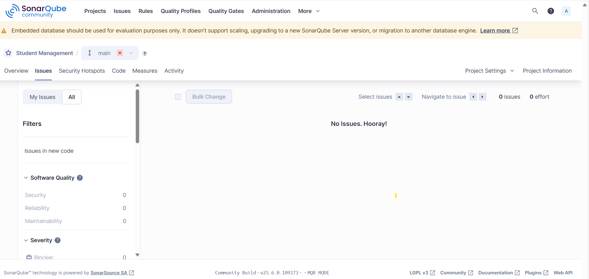
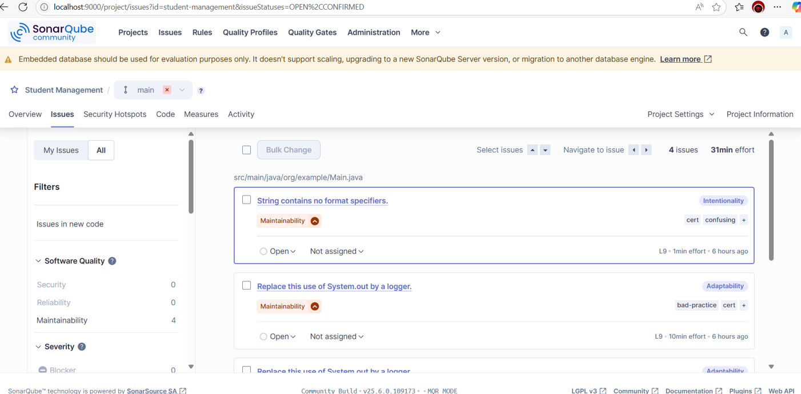
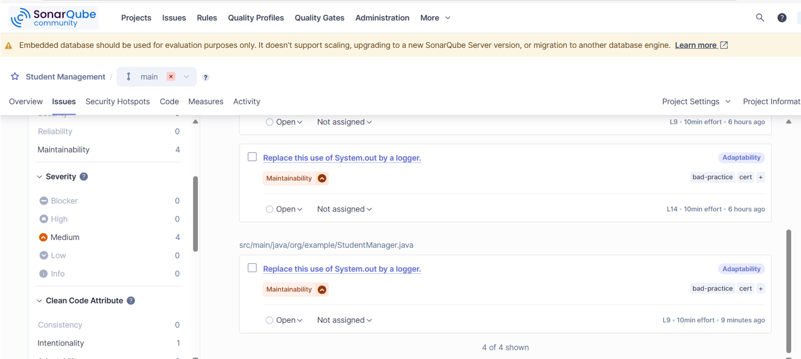
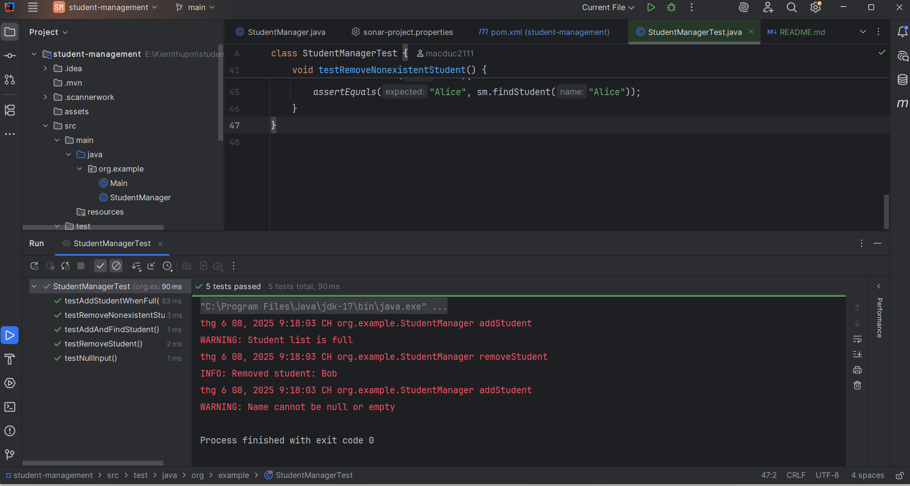
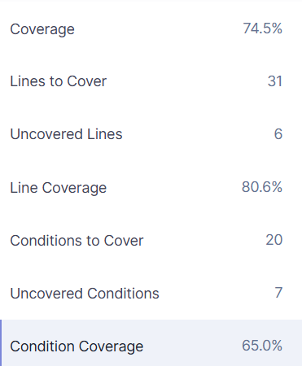

# Báo cáo: Phân tích và cải thiện chất lượng mã nguồn với SonarQube

**Họ tên**: Mạc Anh Đức

**MSSV**: BIT220221

**Bài tập**: Phân tích và cải thiện chất lượng mã nguồn với SonarQube

---

## Ảnh minh hoạ: Toàn bộ vấn đề đã khắc phục



---

## 1. Cài đặt và cấu hình SonarQube

* Cài SonarQube Community Edition trên Windows
* Truy cập: [http://localhost:9000](http://localhost:9000)
* Tạo token và chỉnh file `sonar-project.properties`:

```properties
sonar.projectKey=student-management
sonar.projectName=Student Management
sonar.projectVersion=1.0
sonar.sources=src/main/java
sonar.java.binaries=target/classes
sonar.coverage.jacoco.xmlReportPaths=target/site/jacoco/jacoco.xml
sonar.login=<your_token>
```

---

## 2. Vấn đề phát hiện ban đầu từ SonarQube




| STT | File                | Dòng | Loại       | Mô tả                                            |
| --- | ------------------- | ---- | ---------- | ------------------------------------------------ |
| 1   | Main.java           | 9    | Code Smell | `printf()` không dùng định dạng                  |
| 2   | Main.java           | 9    | Code Smell | Dùng `System.out` thay Logger                    |
| 3   | StudentManager.java | 9    | Code Smell | `System.out.println` thay Logger (tên null)      |
| 4   | StudentManager.java | 14   | Code Smell | `System.out.println` thay Logger (xóa sinh viên) |
| 5   | StudentManager.java | 16   | Code Smell | Logger chưa dùng `String.format`                 |
| 6   | StudentManager.java | 41   | Code Smell | Logger gọi `String.format()` không có điều kiện  |

---

## 3. Mã nguồn sau khi cải thiện

### Trước:

```java
System.out.println("Removed student: " + name);
```

### Sau:

```java
logger.info(String.format("Removed student: %s", name));
```

### Xử lý thêm:

```java
if (name == null || name.trim().isEmpty()) {
    logger.warning("Name cannot be null or empty");
    return;
}
```

---

## 4. Kiểm thỮd đơn vị với JUnit

### Ảnh minh hoạ:



### File `StudentManagerTest.java`

```java
package org.example;
import org.junit.jupiter.api.Test;
import static org.junit.jupiter.api.Assertions.*;

class StudentManagerTest {
    @Test void testAddAndFindStudent() {
        StudentManager sm = new StudentManager();
        sm.addStudent("Alice");
        assertEquals("Alice", sm.findStudent("Alice"));
    }

    @Test void testRemoveStudent() {
        StudentManager sm = new StudentManager();
        sm.addStudent("Bob");
        sm.removeStudent("Bob");
        assertNull(sm.findStudent("Bob"));
    }

    @Test void testNullInput() {
        StudentManager sm = new StudentManager();
        sm.addStudent(null);
        assertNull(sm.findStudent(null));
    }

    @Test void testAddStudentWhenFull() {
        StudentManager sm = new StudentManager();
        for (int i = 0; i < 100; i++) sm.addStudent("S" + i);
        sm.addStudent("Overflow");
        assertNull(sm.findStudent("Overflow"));
    }

    @Test void testRemoveNonexistentStudent() {
        StudentManager sm = new StudentManager();
        sm.addStudent("Alice");
        sm.removeStudent("Bob");
        assertEquals("Alice", sm.findStudent("Alice"));
    }
}
```

---

## 5. Độ phủ mã (Code Coverage)



* **Coverage**: 74.5%
* **Line coverage**: 80.6%
* **Condition coverage**: 65.0%

---

## 6. Đánh giá và đối chiếu

| Tiêu chí               | Trước khi sửa | Sau khi cải thiện |
| ---------------------- | ------------- | ----------------- |
| Code Smells            | 6             | 0                 |
| Bugs / Vulnerabilities | 0             | 0                 |
| Test Pass              | Chưa test     | ✔ 100%            |
| Coverage               | 0%            | ✔ 74.5%           |

---

## 7. Kết luận và đánh giá cá nhân

Việc sử dụng **SonarQube** đã mang lại cho em một cái nhìn rõ ràng hơn về chất lượng mã nguồn của chính mình. Trước đây, em chỉ tập trung làm sao cho chương trình chạy đúng và qua được các test case. Tuy nhiên, sau khi tích hợp SonarQube, em đã ý thức được tầm quan trọng của việc viết mã sạch, rõ ràng và dễ bảo trì.

Những vấn đề như dùng `System.out.println` thay vì `Logger`, hoặc gọi `String.format()` không có điều kiện có thể dễ dàng bị bỏ qua nếu không có công cụ phân tích tĩnh như SonarQube. Nhờ những cảnh báo cụ thể từ SonarQube, em đã học được cách cấu trúc lại mã nguồn hợp lý hơn, tuân thủ nguyên tắc thiết kế, và tránh được những lỗi nhỏ nhưng ảnh hưởng đến maintainability.

Kết hợp SonarQube với kiểm thử JUnit giúp em kiểm tra cả **tính đúng đắn** và **chất lượng kỹ thuật** của phần mềm. Sau khi viết test đơn vị đầy đủ, độ phủ mã đã tăng lên 74.5% và tất cả test đều pass, điều đó chứng minh rằng các chức năng chính đều được kiểm thử kỹ càng.

Tóm lại, SonarQube không chỉ là một công cụ kiểm tra mã – mà còn là một người bạn đồng hành giúp em nâng cao kỹ năng lập trình, hiểu sâu hơn về kỹ thuật phần mềm chuyên nghiệp và biết cách viết code không chỉ đúng mà còn tốt. Đây là một kỹ năng rất cần thiết cho công việc sau này trong ngành IT.
