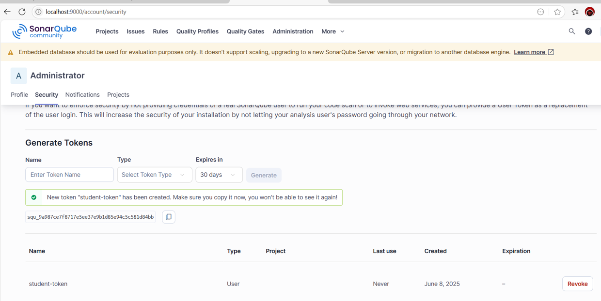
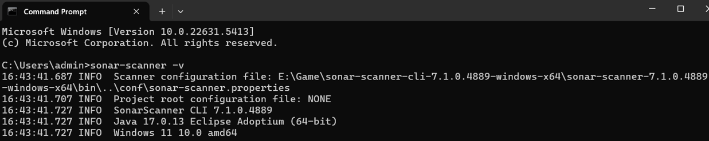

# Báo cáo: Phân tích và cải thiện chất lượng mã nguồn với SonarQube

**Học viên**: Mạc Anh Đức

**MSSV**: BIT220221

**Bài tập**: Phân tích và cải thiện chất lượng mã nguồn với SonarQube

---

## 1. Cài đặt và cấu hình SonarQube & SonarScanner

### Cài đặt SonarQube

* Truy cập: [https://www.sonarsource.com/products/sonarqube/downloads/](https://www.sonarsource.com/products/sonarqube/downloads/)
* Tải bản **Community Edition** → giải nén thư mục
* Mở `StartSonar.bat` (Windows) tại: `sonarqube/bin/windows-x86-64/StartSonar.bat`
* Truy cập trình duyệt: [http://localhost:9000](http://localhost:9000)
* Đăng nhập: `admin/admin` → đổi mật khẩu
* Tạo **user token** tại: **Account → My Account → Security**

*Ảnh minh họa tạo token:*


---

### Cài đặt SonarScanner

* Tải tại: [https://docs.sonarsource.com/sonarqube/latest/analysis/scan/sonarscanner/](https://docs.sonarsource.com/sonarqube/latest/analysis/scan/sonarscanner/)
* Giải nén và thêm đường dẫn `bin` vào biến môi trường `PATH`
* Kiểm tra bằng lệnh:

```bash
sonar-scanner -v
```

*Kết quả kiểm tra:*


---

## 2. Tạo cấu hình `sonar-project.properties`

```properties
sonar.projectKey=student-management
sonar.projectName=Student Management
sonar.projectVersion=1.0
sonar.sources=src/main/java
sonar.java.binaries=target/classes
sonar.coverage.jacoco.xmlReportPaths=target/site/jacoco/jacoco.xml
sonar.login=<your_token>
```

---

## 3. Các vấn đề được phát hiện ban đầu bởi SonarQube

*Ảnh minh họa:*


| STT | File                | Dòng | Loại       | Mô tả                                            |
| --- | ------------------- | ---- | ---------- | ------------------------------------------------ |
| 1   | Main.java           | 9    | Code Smell | `printf()` không dùng định dạng                  |
| 2   | Main.java           | 9    | Code Smell | Dùng `System.out` thay Logger                    |
| 3   | StudentManager.java | 9    | Code Smell | `System.out.println` thay Logger (tên null)      |
| 4   | StudentManager.java | 14   | Code Smell | `System.out.println` thay Logger (xóa sinh viên) |
| 5   | StudentManager.java | 16   | Code Smell | Logger chưa dùng `String.format`                 |
| 6   | StudentManager.java | 41   | Code Smell | Logger gọi `String.format()` không có điều kiện  |

---

## 4. Mã nguồn sau khi cải thiện

### Trước:

```java
System.out.println("Removed student: " + name);
```

### Sau:

```java
logger.info(String.format("Removed student: %s", name));
```

### Trích đoạn xử lý null:

```java
if (name == null || name.trim().isEmpty()) {
    logger.warning("Name cannot be null or empty");
    return;
}
```

*Sau khi sửa, không còn lỗi:*


---

## 5. Kiểm thử đơn vị với JUnit

*Ảnh minh hoạ kết quả test:*


### File `StudentManagerTest.java`

```java
package org.example;
import org.junit.jupiter.api.Test;
import static org.junit.jupiter.api.Assertions.*;

class StudentManagerTest {
    @Test void testAddAndFindStudent() {
        StudentManager sm = new StudentManager();
        sm.addStudent("Alice");
        assertEquals("Alice", sm.findStudent("Alice"));
    }
    @Test void testRemoveStudent() {
        StudentManager sm = new StudentManager();
        sm.addStudent("Bob");
        sm.removeStudent("Bob");
        assertNull(sm.findStudent("Bob"));
    }
    @Test void testNullInput() {
        StudentManager sm = new StudentManager();
        sm.addStudent(null);
        assertNull(sm.findStudent(null));
    }
    @Test void testAddStudentWhenFull() {
        StudentManager sm = new StudentManager();
        for (int i = 0; i < 100; i++) sm.addStudent("S" + i);
        sm.addStudent("Overflow");
        assertNull(sm.findStudent("Overflow"));
    }
    @Test void testRemoveNonexistentStudent() {
        StudentManager sm = new StudentManager();
        sm.addStudent("Alice");
        sm.removeStudent("Bob");
        assertEquals("Alice", sm.findStudent("Alice"));
    }
}
```

---

## 6. Độ phủ mã (Code Coverage)

*Ảnh từ SonarQube:*


* **Coverage**: 74.5%
* **Line coverage**: 80.6%
* **Condition coverage**: 65.0%

---

## 7. Đánh giá và đối chiếu kết quả

| Tiêu chí               | Trước khi sửa | Sau khi cải thiện |
| ---------------------- | ------------- | ------------- |
| Code Smells            | 6             | 0             |
| Bugs / Vulnerabilities | 0             | 0             |
| Test Pass              | Chưa test     | 100%          |
| Coverage               | 0%            | 74.5%         |

---

## 8. Kết luận và đánh giá cá nhân

Việc sử dụng SonarQube đã mang lại cho em một cái nhìn rõ ràng hơn về chất lượng mã nguồn của chính mình. Trước đây, em chỉ tập trung làm sao cho chương trình chạy đúng và qua được các test case. Tuy nhiên, sau khi tích hợp SonarQube, em đã ý thức được tầm quan trọng của việc viết mã sạch, rõ ràng và dễ bảo trì.

Những vấn đề như dùng `System.out.println` thay vì `Logger`, hoặc gọi `String.format()` không có điều kiện có thể dễ dàng bị bỏ qua nếu không có công cụ phân tích tĩnh như SonarQube. Nhờ những cảnh báo cụ thể từ SonarQube, em đã học được cách cấu trúc lại mã nguồn hợp lý hơn, tuân thủ nguyên tắc thiết kế, và tránh được những lỗi nhỏ nhưng ảnh hưởng đến maintainability.

Kết hợp SonarQube với kiểm thử JUnit giúp em kiểm tra cả **tính đúng đắn** và **chất lượng kỹ thuật** của phần mềm. Sau khi viết test đơn vị đầy đủ, độ phủ mã đã tăng lên 74.5% và tất cả test đều pass, điều đó chứng minh rằng các chức năng chính đều được kiểm thử kỹ càng.

Tóm lại, SonarQube không chỉ là một công cụ kiểm tra mã – mà còn là một người bạn đồng hành giúp em nâng cao kỹ năng lập trình, hiểu sâu hơn về kỹ thuật phần mềm chuyên nghiệp và biết cách viết code không chỉ đúng mà còn tốt. Đây là một kỹ năng rất cần thiết cho công việc sau này trong ngành IT.
